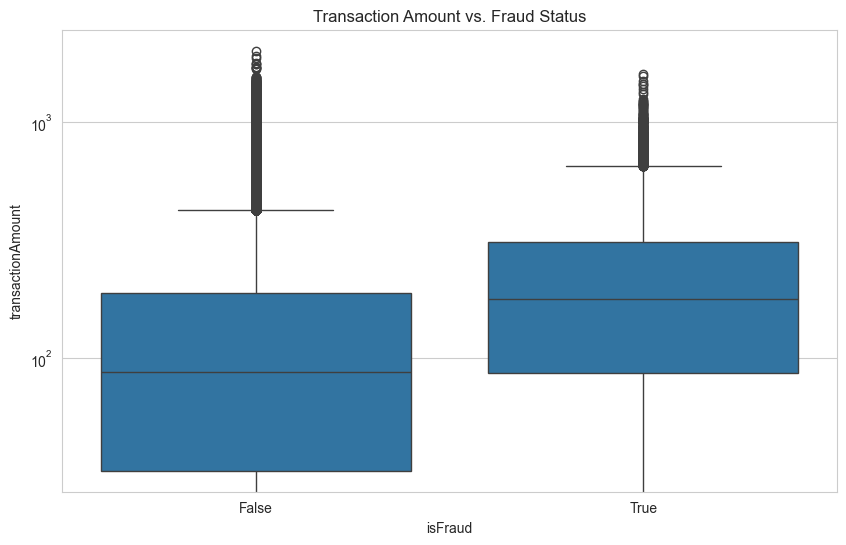
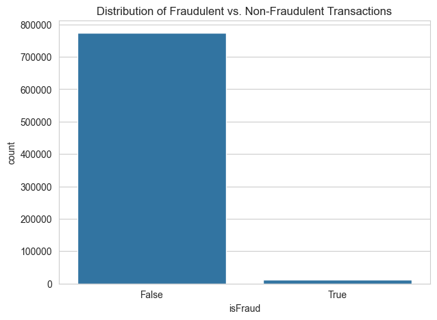
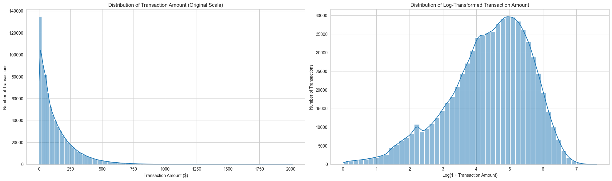
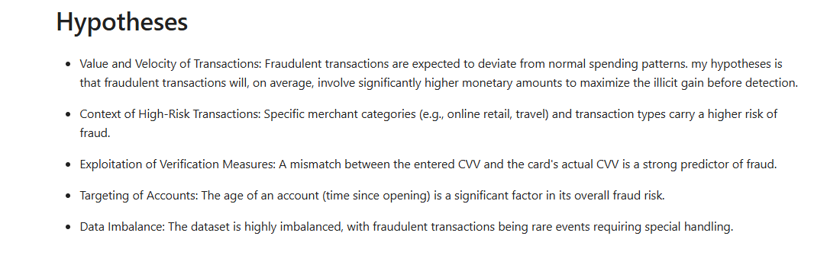
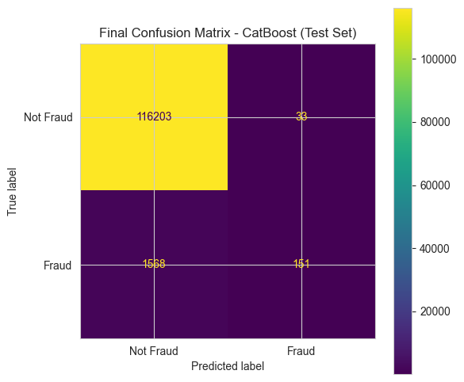

# Credit Card Fraud Detection

## Project Overview

*This project is a comprehensive, end-to-end machine learning pipeline for detecting fraudulent credit card transactions. It uses a real-world dataset to demonstrate skills in data cleaning, exploratory data analysis, advanced feature engineering, and comparative model evaluation. The final model is a high-precision classifier capable of identifying fraudulent transactions while minimizing false alarms.*

## Key Features & Methodology

* **Data Cleaning:** Handled missing values, duplicates, and incorrect data types.
* **Exploratory Data Analysis (EDA):** Performed deep analysis on transaction patterns, time-based trends, and class imbalance. Visualizations from the EDA phase revealed key insights into the data's structure and the nature of the transactions.

    
    

    *The distribution of transaction amounts was heavily skewed, so a log transformation was applied to normalize it for better modeling performance.*

    

* **Advanced Feature Engineering:** Created sophisticated features, including:
    * Flags for legitimate reversals and multi-swipe transactions.
    * Time-based features like account age and days to card expiration.
    * Financial ratios and log-transformations.
* **Preprocessing Pipeline:** Utilized a robust pipeline with Target Encoding for high-cardinality features, `RobustScaler` to handle outliers, and **SMOTE** to address severe class imbalance on the training data only.
* **Model Training & Tuning:** Comparatively trained and tuned three models: Logistic Regression (baseline), XGBoost, and CatBoost using `RandomizedSearchCV`.
* **Advanced Evaluation:** Implemented a custom `ModelEvaluator` class to find the optimal decision threshold for each model, ensuring performance is measured based on the F1-Score, not an arbitrary default.

## Key Results & Conclusion

* The analysis showed a clear trade-off between models that have high recall (catching more fraud but with many false alarms) and models with high precision (more reliable alerts). The visualization below supported the initial hypothesis.

    

* The final champion model, **CatBoost**, was selected due to its outstanding **Precision of 80%** on the validation set after threshold tuning. The confusion matrix below demonstrates the model's performance in distinguishing between classes.

    

* This high-precision model is ideal for a real-world business scenario, as it provides high-confidence alerts that can be efficiently actioned by a fraud investigation team.

## How to Use This Repository

1.  **Clone the repository:**
    ```bash
    git clone [https://github.com/hmankar01/Credit-Card-Fraud-Detection](https://github.com/hmankar01/Credit-Card-Fraud-Detection)
    ```
2.  **Create a virtual environment and install dependencies:**
    ```bash
    python -m venv .venv
    source .venv/bin/activate  # On Windows use `.venv\Scripts\activate`
    pip install -r requirements.txt
    ```
3.  **Run the Jupyter Notebook:**
    Launch Jupyter and open the `Credit_Fraud_analysis_.ipynb` file to see the full analysis and code.
